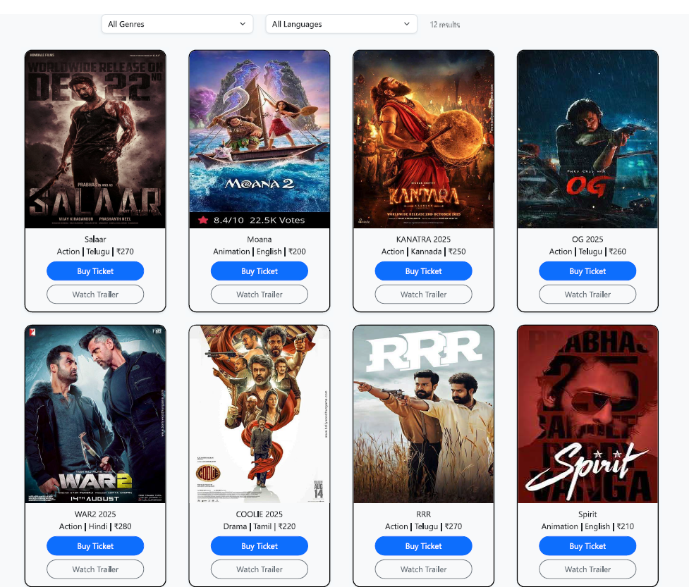
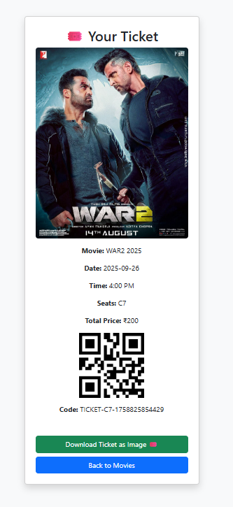

🎬 CineLock (Frontend)

CineLock is a React-based movie ticket booking UI.
It includes interactive seat selection, modern design, and QR-based ticket display.
👉 Note: This project is frontend only (no backend).

✨ Features

Browse movies (static/demo data)
Interactive seat selection
Login / Signup
Payment page
QR code ticket display
Responsive design

🚀 Getting Started
Prerequisites

Node.js v18+

npm v9+

Installation

# Clone the repo

git clone https://github.com/sujay-707/CineLockz.git
cd CineLockz

# Install dependencies

npm install

# Start development server

npm start

Runs on 👉 http://localhost:3000

Build for Production
npm run build

Output will be in the build/ folder.

🌐 Live Demo

Try CineLock live here:
https://cinelockz.netlify.app/

free to use and modify,

## 📸 Screenshots / Demo (Clickable)
Click any image to open its live page:

  
*Movies Page*  

  
*Seat Selection*  

  
*Seat Unlocking / Seat Simulator*  

  
*Ticket with QR Code*
